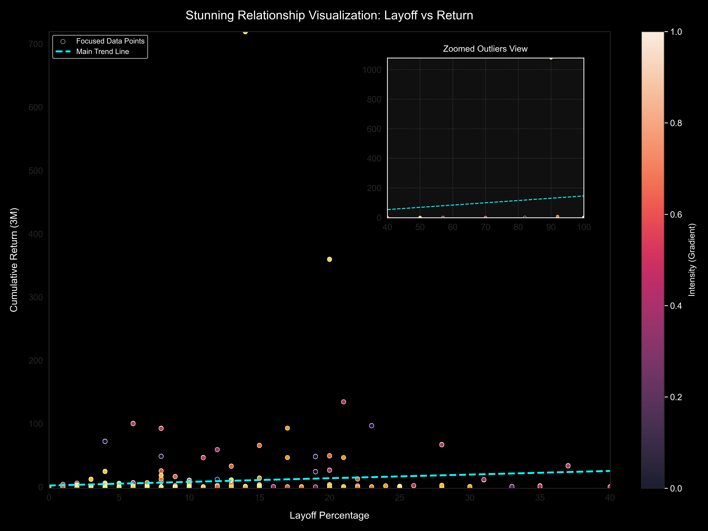
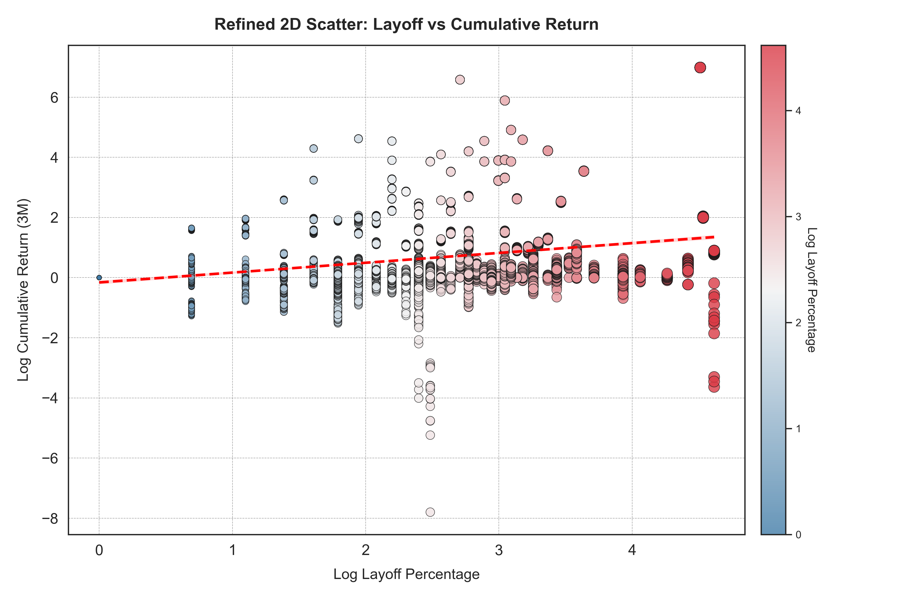

# **The Impact of Post-COVID-19 Tech Layoffs on Stock Price Movements: A Case Study of Tesla and Comparable Firms**

## **Project Description**  
This project analyzes the relationship between post-COVID-19 tech layoffs and stock price movements, using Tesla and similar firms as case studies. It investigates whether layoffs impact stock prices negatively or serve as signals of operational optimization. The analysis is based on data from publicly traded companies with relatively high market capitalizations.  

**Key Insights**:  
While layoffs are often perceived as negative, the results show that stock prices of these firms tend to remain stable or even increase post-layoff events. This could indicate proactive business adjustments and optimistic market expectations.

---

## **Project Structure**

```
.
├── README.md                     # Project documentation
├── source_data/                  # Original and cleaned data files
│   ├── Company_list.csv          # List of companies analyzed
│   ├── adjusted_data.csv         # Cleaned and processed stock data
│   ├── layoff data.csv           # Raw layoff data
│   ├── layoff data with city lat and lng.csv  # Layoff data with locations
│   ├── melted_data.7z            # Melted dataset (compressed)
│   ├── merged_data.7z            # Combined dataset (compressed)
│   └── uscities.csv              # City-level information
│
├── code/                         # Python Jupyter Notebooks
│   ├── layoff data clean.ipynb   # Data cleaning and preprocessing
│   ├── layoff data getting.ipynb # Layoff data acquisition
│   ├── layoff data visualization.ipynb # Layoff data visualization
│   ├── Stock price data getting.ipynb # Stock price data retrieval
│   ├── Regression models and visualization.ipynb # Regression analysis
│   ├── yahoo finance data.ipynb  # Historical stock data retrieval via yfinance
│   └── visualization of single company.ipynb # Single-company analysis
│
├── visualization results/        # Analysis results and plots
│   ├── Cumulative Return in 3 Months vs Layoff Percentage.png
│   ├── relationship_plot.png
│   ├── daily_total_layoffs.html
│   └── us_layoff_heatmap_weighted.html
│
└── proposal.pdf                  # Project proposal
```

---

## **Data Sources**  

### **Layoff Data**  
- Source: [Layoffs.fyi](https://layoffs.fyi)  
- **Method**: Data was manually extracted using screenshots and converted into structured tables with GPT's text recognition capabilities after facing web scraping/API limitations.  

### **Stock Price Data**  
- Source: Yahoo Finance  
- **Tool**: Python library `yfinance`  
- **Method**: Company tickers were retrieved based on the cleaned company list, and historical stock data was collected.  

---

## **Dependencies**

To reproduce this project, install the following Python libraries:  

```bash
pip install pandas numpy matplotlib statsmodels datetime seaborn yfinance
```

**Full List of Dependencies**:  
- pandas  
- numpy  
- matplotlib.pyplot  
- statsmodels.api  
- datetime  
- mpl_toolkits.axes_grid1.inset_locator  
- seaborn  
- yfinance  
- os  

---

## **Code Description**

- **`layoff data clean.ipynb`**: Cleans and processes raw layoff data.  
- **`layoff data getting.ipynb`**: Documents layoff data acquisition.  
- **`Stock price data getting.ipynb`**: Retrieves stock data from Yahoo Finance using `yfinance`.  
- **`Regression models and visualization.ipynb`**: Performs regression analysis and visualizes results.  
- **`visualization of single company.ipynb`**: Visualizes the impact for individual companies.  

---

## **Visualization Results**

This section contains key visualizations generated from the analysis, including Tesla's daily stock price trends and heatmaps of company layoffs.

1. Tesla Daily Stock Price Changes
[Interactive Chart: Tesla Daily Stock Price](visualization%20results/daily_total_layoffs.html)
Description: An interactive chart illustrating Tesla's daily stock price changes during the analyzed period.
Usage: Open the HTML file in a browser to interact with the plot and explore trends.

2. Company Layoff Heatmaps
These heatmaps highlight the distribution of layoffs across companies and regions.

### Company Layoff Heatmap  
**Description**: Displays the distribution of companies that initiated layoffs.  
[Click here to view the interactive heatmap](visualization_results/us_layoff_heatmap_offline.html)

### Layoff Count Heatmap  
**Description**: Visualizes the number of layoffs across different regions in the U.S.  
[Click here to view the interactive heatmap](visualization_results/us_layoff_heatmap_weighted.html)


3. Regression Visualization Results
These visualizations summarize the relationship between layoffs and stock price movements.

Scatter Plot of Regression Results


Description: A scatter plot showing the relationship between cumulative stock returns and layoff percentages.
Refined 2D Scatter Plot


Description: An enhanced version of the scatter plot, providing a clearer representation of regression results.

## **Summary of Findings**

1. **Model and Data Issues**:  
   - The dataset is relatively small, with ~300 observations.  
   - Companies chosen are publicly traded and have high market capitalizations, resulting in relatively stable stock prices.

2. **Investor Sentiment**:  
   - Layoffs can be perceived as operational optimization, reducing costs and potentially improving profitability.  
   - Market optimism during the layoff period might offset negative sentiment.

3. **Conclusion**:  
   While layoffs are often linked to economic downturns, proactive adjustments by firms may foster investor confidence and stabilize stock prices.

---

## **How to Reproduce**

1. **Clone the repository**:  
   ```bash
   git clone https://github.com/AdamXiaoRose/Final_Project_Emily-Adam.git
   cd your_repository
   ```

2. **Install dependencies**:  
   ```bash
   pip install pandas numpy matplotlib statsmodels datetime seaborn yfinance
   ```

3. **Run Jupyter Notebooks**:  
   Open each notebook in the `code/` directory and execute the cells sequentially.  

4. **Check Results**:  
   Visualizations and analysis results are available in the `visualization results/` folder.
   

## **Project Maintainer**

Maintained by: Shuti Zhao, Xiao Xu  
Contact: xx155@georgetown.edu/sz734@georgetown.edu

